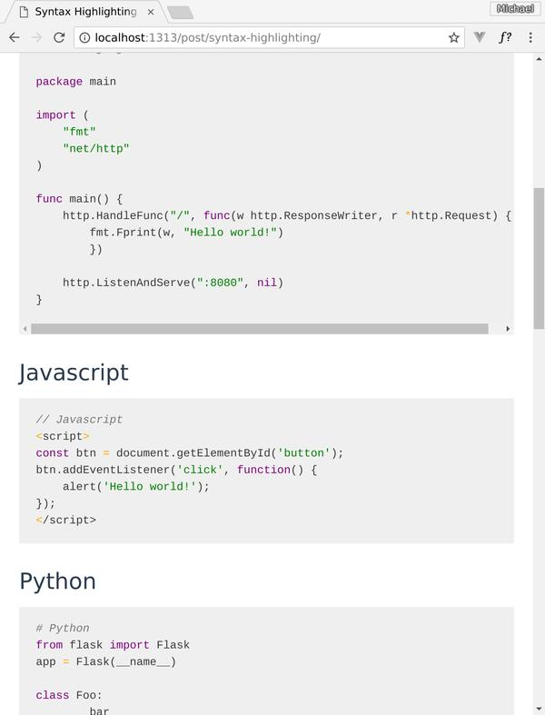

Sass (SCSS) styles enable easy construction of syntax highlighting themes compatible with both:

* [Pygments][], a Python module and utilities used everywhere
* [Chroma][], a Go language package incorporated into the [Hugo][] static site
  generator.

This package includes four example themes:

* Taapaca
* Github (ish)
* Vimspectrgrey-dark
* Vimspectr210-light

See the [project page](https://solutionroute.github.io/chroma-sass-themes/) to
see all four in action.

## Acknowledgement

This is a fork of [sass-pygments-theme-base], thanks @MoOx for that work. 

## Installation

**Requirements**: A Sass compiler; this project is set up to use `npm`.

Clone:

	git clone https://github.com/solutionroute/chroma-sass-themes.git

Or add as submodule within your project's `scss` directory:

	git submodule add https://github.com/solutionroute/chroma-sass-themes.git

Install node-sass:

	cd chroma-sass-themes
	npm install node-sass

Generate the pre-defined themes:

	npm run build

## Using a predefined chroma theme

Assuming you've added `chroma-sass-themes` in your project's `scss` directory,
include in your main scss file:

	@import "chrome-sass-themes/scss/taapaca";

## Examples

See `scss/taapaca.scss` in the accompanying screenshot for a minimal but
functional example of the output.  The [project
page](https://solutionroute.github.io/chroma-sass-themes/) has screenshots of
the other predefined themes in this package.

## TODO

* Add sample HTML 

[Chroma]: https://github.com/alecthomas/chroma
[Pygments]: http://pygments.org/
[sass-pygments-theme-base]: https://github.com/MoOx/sass-pygments-theme-base
[Hugo]: https://gohugo.io/
